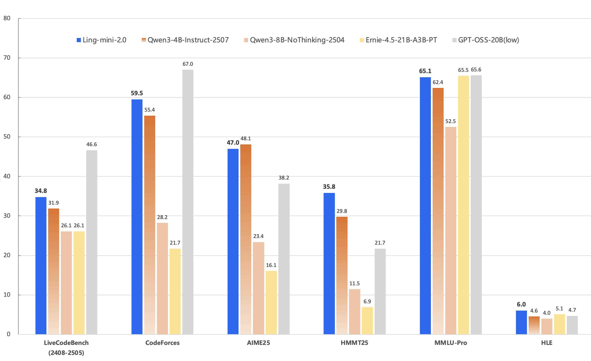
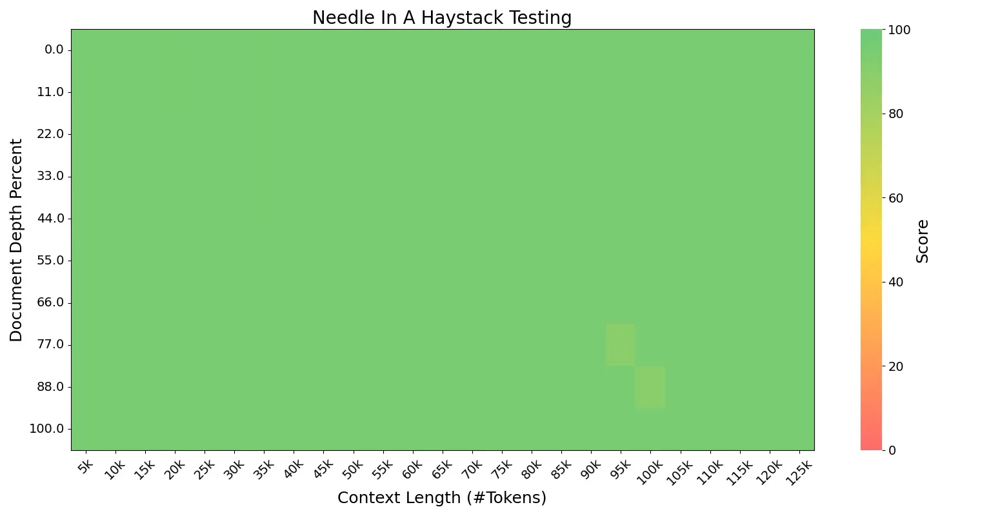

# Ling-V2
<p align="center"></p>

<p align="center">🤗 <a href="https://huggingface.co/inclusionAI">Hugging Face</a>&nbsp&nbsp | &nbsp&nbsp🤖 <a href="https://modelscope.cn/organization/inclusionAI">ModelScope</a></p>


## Introduction

Today, we are excited to announce the open-sourcing of __Ling 2.0__ — a family of MoE-based large language models that combine __SOTA performance__ with __high efficiency__.
The first released version, Ling-mini-2.0, is compact yet powerful. It has __16B total parameters__, but only __1.4B__ are activated per input token (non-embedding 789M). Trained on more than __20T tokens__ of high-quality data and enhanced through multi-stage supervised fine-tuning and reinforcement learning, Ling-mini-2.0 achieves remarkable improvements in complex reasoning and instruction following. With just 1.4B activated parameters, it still reaches the top-tier level of sub-10B dense LLMs and even matches or surpasses much larger MoE models.

<p align="center"></p>

### Strong General and Professional Reasoning

We evaluated Ling-mini-2.0 on challenging general reasoning tasks in coding (LiveCodeBench, CodeForces) and mathematics (AIME 2025, HMMT 2025), as well as knowledge-intensive reasoning tasks across multiple domains (MMLU-Pro, Humanity's Last Exam). Compared with sub-10B dense models (e.g., Qwen3-4B-instruct-2507, Qwen3-8B-nothinking) and larger-scale MoE models (Ernie-4.5-21B-A3B-PT, GPT-OSS-20B/low), Ling-mini-2.0 demonstrated outstanding overall reasoning capabilities.

### 7× Equivalent Dense Performance Leverage

Guided by Ling Scaling Laws, Ling 2.0 adopts a __1/32 activation ratio__ MoE architecture, with empirically optimized design choices in expert granularity, shared expert ratio, attention ratio, aux-loss free + sigmoid routing strategy, MTP loss, QK-Norm, half RoPE, and more. This enables small-activation MoE models to achieve over __7× equivalent dense performance__. In other words, __Ling-mini-2.0 with only 1.4B activated parameters (non-embedding 789M) can deliver performance equivalent to a 7–8B dense model__.

### High-speed Generation at 300+ token/s

<p align="center"></p>

The highly sparse small-activation MoE architecture also delivers significant training and inference efficiency. In simple QA scenarios (within 2000 tokens), __Ling-mini-2.0 generates at 300+ token/s (on H20 deployment)__ — more than __2× faster__ than an 8B dense model. Ling-mini-2.0 is able to handle __128K context length__ with YaRN, as sequence length increases, the relative speedup can reach __over 7×__.

<p align="center"></p>

### Open-sourced FP8 Efficient Training Solution

Ling 2.0 employs __FP8 mixed-precision training__ throughout. Compared with BF16, experiments with over 1T training tokens show nearly identical loss curves and downstream benchmark performance. To support the community in efficient continued pretraining and fine-tuning under limited compute, we are also open-sourcing our __FP8 training solution__. Based on tile/blockwise FP8 scaling, it further introduces FP8 optimizer, FP8 on-demand transpose weight, and FP8 padding routing map for extreme memory optimization. On 8/16/32 80G GPUs, compared with LLaMA 3.1 8B and Qwen3 8B, __Ling-mini-2.0 achieved 30–60% throughput gains with MTP enabled, and 90–120% throughput gains with MTP disabled__.

### A More Open Opensource Strategy

We believe Ling-mini-2.0 is an ideal starting point for MoE research. For the first time at this scale, it integrates 1/32 sparsity, MTP layers, and FP8 training — achieving both strong effectiveness and efficient training/inference performance, making it a prime candidate for the small-size LLM segment.
To further foster community research, in addition to releasing the post-trained version, we are also open-sourcing __five pretraining checkpoints__: the pre-finetuning Ling-mini-2.0-base, along with four base models trained on 5T, 10T, 15T, and 20T tokens, enabling deeper research and broader applications.


## Model Downloads

You can download the following table to see the various stage of Ling-mini-2.0 models(1.43B activated of 16.26B total params). If you are located in mainland China, we also provide the model on ModelScope.cn to speed up the download process.


|       **Model**        | **Context Length** |                                                                             **Download**                                                                             |
|:----------------------:| :----------------: |:--------------------------------------------------------------------------------------------------------------------------------------------------------------------:|
| Ling-mini-base-2.0-5T  |        4K         |  [🤗 HuggingFace](https://huggingface.co/inclusionAI/Ling-mini-base-2.0-5T) <br>[🤖 ModelScope](https://www.modelscope.cn/models/inclusionAI/Ling-mini-base-2.0-5T)  |
| Ling-mini-base-2.0-10T |        4K         | [🤗 HuggingFace](https://huggingface.co/inclusionAI/Ling-mini-base-2.0-10T) <br>[🤖 ModelScope](https://www.modelscope.cn/models/inclusionAI/Ling-mini-base-2.0-10T) |
| Ling-mini-base-2.0-15T |        4K         | [🤗 HuggingFace](https://huggingface.co/inclusionAI/Ling-mini-base-2.0-15T) <br>[🤖 ModelScope](https://www.modelscope.cn/models/inclusionAI/Ling-mini-base-2.0-15T) |
| Ling-mini-base-2.0-20T |        4K         | [🤗 HuggingFace](https://huggingface.co/inclusionAI/Ling-mini-base-2.0-20T) <br>[🤖 ModelScope](https://www.modelscope.cn/models/inclusionAI/Ling-mini-base-2.0-20T) |
|   Ling-mini-base-2.0   |        32K         |     [🤗 HuggingFace](https://huggingface.co/inclusionAI/Ling-mini-base-2.0) <br>[🤖 ModelScope](https://www.modelscope.cn/models/inclusionAI/Ling-mini-base-2.0)     |
|     Ling-mini-2.0      |        32K         |          [🤗 HuggingFace](https://huggingface.co/inclusionAI/Ling-mini-2.0) <br>[🤖 ModelScope](https://www.modelscope.cn/models/inclusionAI/Ling-mini-2.0)          |


Note: If you are interested in previous version, please visit the past model collections in [Huggingface](https://huggingface.co/inclusionAI) or [ModelScope](https://modelscope.cn/organization/inclusionAI).


## Quickstart

### Convert to safetensors

Models with safetensors format can be downloaded from [HuggingFace](https://huggingface.co/inclusionAI) or [ModelScope](https://modelscope.cn/organization/inclusionAI).
If you want to train your model and eval it, you can convert from dcp produced by training.
```shell
python tools/convert_dcp_to_safe_tensors.py --checkpoint-path ${DCP_PATH} --target-path ${SAFETENSORS_PATH}
```

Currently, BF16 and FP8 formats are supported, you can use convert parameter to handle it:
- `--force-bf16` for BF16 format.
- `--force-fp8` for FP8 format.

### 🤗 Hugging Face Transformers

Here is a code snippet to show you how to use the chat model with `transformers`:

```python
from transformers import AutoModelForCausalLM, AutoTokenizer

model_name = "inclusionAI/Ling-mini-2.0"

model = AutoModelForCausalLM.from_pretrained(
    model_name,
    dtype="auto",
    device_map="auto",
    trust_remote_code=True,
)
tokenizer = AutoTokenizer.from_pretrained(model_name)

prompt = "Give me a short introduction to large language models."
messages = [
    {"role": "system", "content": "You are Ling, an assistant created by inclusionAI"},
    {"role": "user", "content": prompt}
]
text = tokenizer.apply_chat_template(
    messages,
    tokenize=False,
    add_generation_prompt=True
)
model_inputs = tokenizer([text], return_tensors="pt", return_token_type_ids=False).to(model.device)

generated_ids = model.generate(
    **model_inputs,
    max_new_tokens=512
)
generated_ids = [
    output_ids[len(input_ids):] for input_ids, output_ids in zip(model_inputs.input_ids, generated_ids)
]

response = tokenizer.batch_decode(generated_ids, skip_special_tokens=True)[0]
```

### 🤖 ModelScope

If you're in mainland China, we strongly recommend you to use our model from 🤖 <a href="https://modelscope.cn/organization/inclusionAI">ModelScope</a>.

## Deployment

### vLLM

vLLM supports offline batched inference or launching an OpenAI-Compatible API Service for online inference.

#### Environment Preparation

Since the Pull Request (PR) has not been submitted to the vLLM community at this stage, please prepare the environment by following the steps below:

```bash
git clone -b v0.10.0 https://github.com/vllm-project/vllm.git
cd vllm
git apply Ling-V2/inference/vllm/bailing_moe_v2.patch
pip install -e .
```

#### Offline Inference:

```bash
from transformers import AutoTokenizer
from vllm import LLM, SamplingParams

tokenizer = AutoTokenizer.from_pretrained("inclusionAI/Ling-mini-2.0")

sampling_params = SamplingParams(temperature=0.7, top_p=0.8, repetition_penalty=1.05, max_tokens=16384)

llm = LLM(model="inclusionAI/Ling-mini-2.0", dtype='bfloat16')
prompt = "Give me a short introduction to large language models."
messages = [
    {"role": "system", "content": "You are Ling, an assistant created by inclusionAI"},
    {"role": "user", "content": prompt}
]

text = tokenizer.apply_chat_template(
    messages,
    tokenize=False,
    add_generation_prompt=True
)
outputs = llm.generate([text], sampling_params)

```

#### Online Inference:

```bash
vllm serve inclusionAI/Ling-mini-2.0 \
              --tensor-parallel-size 2 \
              --pipeline-parallel-size 1 \
              --use-v2-block-manager \
              --gpu-memory-utilization 0.90
```

To handle long context in vLLM using YaRN, we need to follow these two steps:
1. Add a `rope_scaling` field to the model's `config.json` file, for example:
```json
{
  ...,
  "rope_scaling": {
    "factor": 4.0,
    "original_max_position_embeddings": 32768,
    "type": "yarn"
  }
}
```
2. Use an additional parameter `--max-model-len` to specify the desired maximum context length when starting the vLLM service.

For detailed guidance, please refer to the vLLM [`instructions`](https://docs.vllm.ai/en/latest/).


### SGLang

#### Environment Preparation

We will later submit our model to SGLang official release, now we can prepare the environment following steps:
```shell
pip3 install sglang==0.5.2rc0 sgl-kernel==0.3.7.post1
```
You can use docker image as well:
```shell
docker pull lmsysorg/sglang:v0.5.2rc0-cu126
```
Then you should apply patch to sglang installation:
```shell
# patch command is needed, run `yum install -y patch` if needed
patch -d `python -c 'import sglang;import os; print(os.path.dirname(sglang.__file__))'` -p3 < inference/sglang/bailing_moe_v2.patch
```

#### Run Inference

BF16 and FP8 models are supported by SGLang now, it depends on the dtype of the model in ${MODEL_PATH}. They both share the same command in the following:  

- Start server:
```shell
python -m sglang.launch_server \
    --model-path $MODLE_PATH \
    --host 0.0.0.0 --port $PORT \
    --trust-remote-code \
    --attention-backend fa3
```
MTP is supported for base model, and not yet for chat model. You can add parameter `--speculative-algorithm NEXTN`
to start command.

- Client:
```shell
curl -s http://localhost:${PORT}/v1/chat/completions \
  -H "Content-Type: application/json" \
  -d '{"model": "auto", "messages": [{"role": "user", "content": "What is the capital of France?"}]}'
"""
```
More usage can be found [here](https://docs.sglang.ai/basic_usage/send_request.html)

## Training

We also provide a complete and efficient training framework that covers both pre-training and finetune. Based on this framework, continue training can be performed on the Ling-mini-2.0 checkpoint. With our training framework, the training throughput of the Ling-mini-2.0 model is significantly better than that of the existing Dense 8B model (Qwen3-8B, Llama3-8B).

### Pre-training

[Pretraining demo](./docs/gpu_based_training.md) to Continue pretraining Ling models.

#### Performance Benchmark

The table below shows the pre-training performance of several models, measured in **tokens per second** on 8, 16, and 32 80G GPUs. Ling-mini-2.0 achieves significantly higher training efficiency compared to the baseline, making it easier and more cost-effective to continue pre-training with our [demo scripts](./docs/gpu_based_training.md).

|        **Model**        | **8 x 80G (GBS=128)** | **16 x 80G (GBS=256)** | **32 x 80G (GBS=512)** |
|:-----------------------:| :--------------------: | :---------------------: | :---------------------: |
| LLaMA 3.1 8B (baseline) |         81222          |         161319          |         321403          |
|        Qwen3 8B         |    55775 (-31.33%)     |    109799 (-31.94%)     |    219943 (-31.57%)     |
|      Ling-mini-2.0      |    109532 (+34.86%)    |    221585 (+37.36%)     |    448726 (+39.61%)     |
|  Ling-mini-2.0 w/o MTP  |    128298 (+57.96%)    |    307264 (+90.47%)     |    611466 (+90.25%)     |


### Finetuning

We recommend you to use [Llama-Factory](https://github.com/hiyouga/LLaMA-Factory) to [finetune Ling](./docs/llamafactory_finetuning.md). In addition to that, you can also use [Megatron for finetuning](./docs/megatron_sft_training.md).

## License

This code repository is licensed under [the MIT License](https://github.com/inclusionAI/Ling-V2/blob/master/LICENCE).

## Citation

If you find our work helpful, feel free to give us a cite.

```

```
